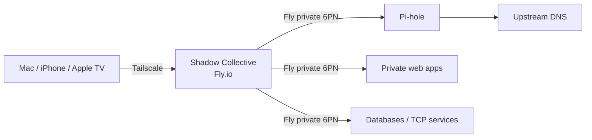

<p align="center">
  
</p>

# Shadow Collective

**A Tailscale-powered private gateway for Fly.io apps, private DNS, Pi-hole, and self-hosted services.**

Shadow Collective gives one Fly.io Machine a persistent Tailscale identity and uses it as the controlled bridge between your tailnet and Fly.io's private 6PN network. Backend apps do **not** need to run Tailscale and do **not** need public Fly services or public IPs.

The normal steady-state workflow is intentionally small:

```bash
# edit config/services.json
fly deploy
```

The first deployment has a one-time bootstrap because Fly and Tailscale both need credentials/identity. After that, the gateway state lives on a Fly Volume and deployments are just `fly deploy`.

## What it does

- Joins one dedicated Fly.io app to your Tailscale tailnet.
- Keeps backend Fly apps private on Fly's `.internal` / 6PN network.
- Reverse-proxies HTTP/HTTPS services from the tailnet to private Fly apps.
- Proxies arbitrary TCP services such as PostgreSQL.
- Forwards TCP + UDP DNS to a private Pi-hole instance.
- Optionally advertises configured backends as **Tailscale Services** for stable service identities.
- Exposes **no public Fly service by default**.
- Persists the Tailscale node identity in a Fly Volume so the gateway keeps a stable tailnet identity.

## Architecture



The important boundary is:

```text
Internet
   X  no public Fly ingress
   |
Tailnet ----> Shadow Collective ----> Fly 6PN ----> private apps
                    |
                    +---- DNS ----> Pi-hole
```

## Quick start

### 1. Create the Fly app once

The included `fly.toml` uses `shadow-collective` as the app name. Fly app names are globally unique, so change the `app` value if needed.

```bash
fly apps create shadow-collective
```

If the app already exists, skip this.

### 2. Create a Tailscale auth key

Create a pre-approved auth key in the Tailscale admin console. A tagged key is recommended if you plan to use Tailscale Services.

Store it in Fly secrets — never commit it:

```bash
fly secrets set TAILSCALE_AUTHKEY='tskey-...'
```

### 3. Deploy

```bash
fly deploy
```

The first deployment creates the `shadow_state` volume declared in `fly.toml`. That volume stores `tailscaled.state` so subsequent Machine replacements keep the same Tailscale node identity.

Check it:

```bash
fly logs
fly ssh console -C '/app/tailscale --socket=/var/run/tailscale/tailscaled.sock status'
```

### 4. Add services

Edit [`config/services.json`](config/services.json), then:

```bash
fly deploy
```

Example:

```json
{
  "health_listen": "0.0.0.0:9000",
  "http": [
    {
      "name": "my-app",
      "listen": "0.0.0.0:10002",
      "upstream": "http://my-app.internal:8080"
    }
  ],
  "tcp": [],
  "dns": {
    "enabled": false,
    "listen": "0.0.0.0:53",
    "upstream": "shadow-pihole.internal:53"
  }
}
```

From a tailnet device, the simplest form is then:

```text
http://shadow-collective:10002
```

For stable service names such as `svc:my-app`, see [Tailscale Services](docs/tailscale.md).

## Pi-hole

A companion private Pi-hole Fly configuration is included at [`deploy/pihole/fly.toml`](deploy/pihole/fly.toml). Pi-hole does not need Tailscale. It stays on Fly's private network and Shadow Collective forwards DNS to it.

```text
Apple TV / Mac / phone
       |
       | DNS over tailnet
       v
Shadow Collective :53
       |
       | Fly private 6PN
       v
shadow-pihole.internal:53
       |
       v
    Pi-hole
```

See [docs/pihole.md](docs/pihole.md) for the complete setup.

> Pi-hole can block many ad, tracking, telemetry, and malicious domains, but DNS filtering does not reliably remove YouTube pre-roll/mid-roll video ads because YouTube can deliver ads and video from the same infrastructure.

## Repository layout

```text
.
├── cmd/shadow-collective/        # gateway process
├── internal/
│   ├── config/                   # JSON config + validation
│   └── gateway/                  # HTTP, TCP, and DNS proxying
├── config/
│   ├── services.json             # active gateway config
│   ├── services.example.json
│   ├── tailscale-services.json   # active Tailscale Services config
│   └── tailscale-services.example.json
├── deploy/pihole/fly.toml        # optional private Pi-hole app
├── docs/
├── scripts/start.sh              # tailscaled + gateway boot
├── Dockerfile
└── fly.toml
```

## Documentation

- [Architecture](docs/architecture.md)
- [Networking](docs/networking.md)
- [Deployment](docs/deployment.md)
- [Tailscale and Tailscale Services](docs/tailscale.md)
- [Pi-hole](docs/pihole.md)
- [Adding a service](docs/adding-a-service.md)
- [Security model](docs/security.md)

## Local development

The gateway is standard-library Go and does not require Tailscale to unit-test:

```bash
go test ./...
go run ./cmd/shadow-collective -config config/services.json
```

The Docker image embeds the official Tailscale binaries and starts both `tailscaled` and the gateway process.

## Design rule

**Backend services should not know or care that Tailscale exists.**

They listen privately on Fly. Shadow Collective owns tailnet identity, routing, DNS forwarding, and service exposure.
